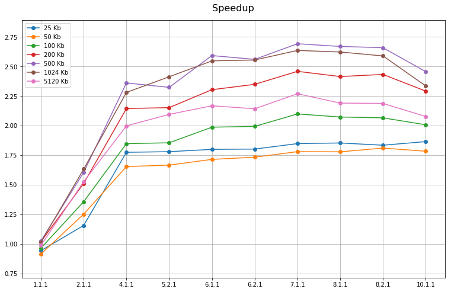
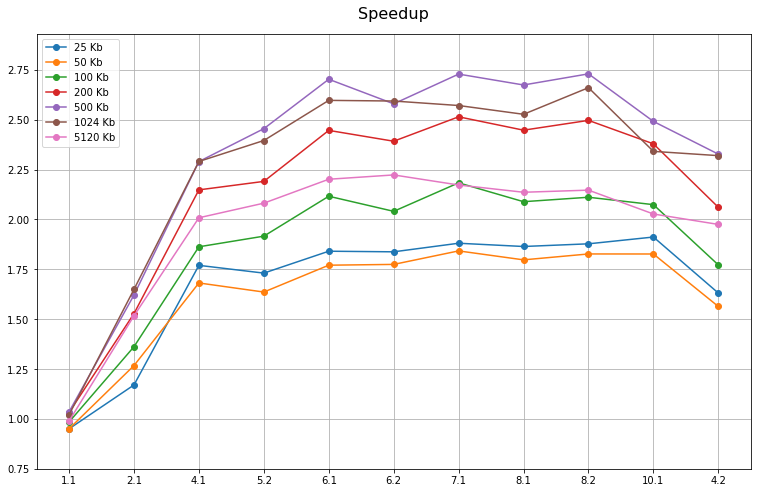
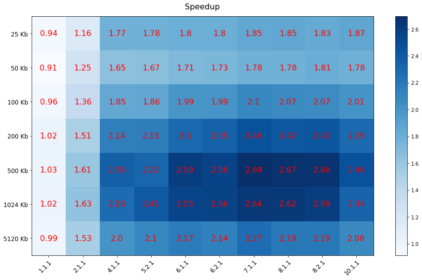
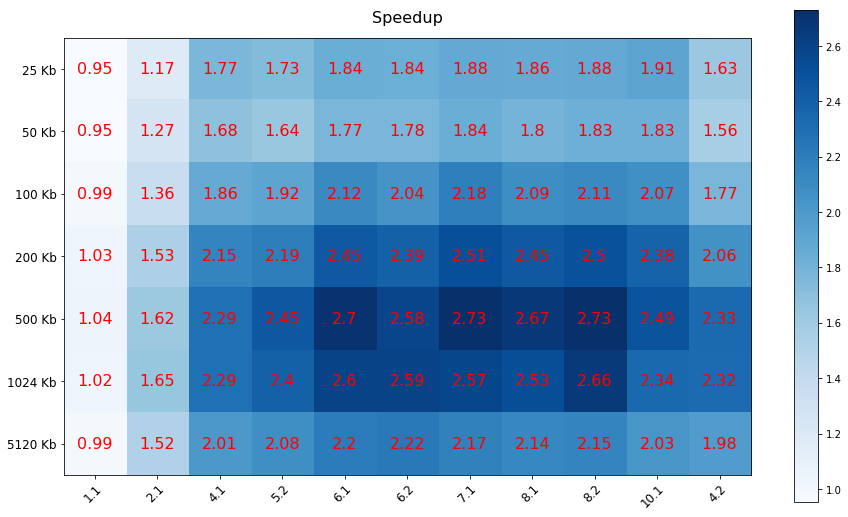

# Bwtzip OpenMP
*A parallel version of the bwtzip project implemented by means of the OpenMP APIs*

In this project the [bwtzip] lossless data compression library from Stephan T. Lavavej was extended by means of [OpenMP] APIs in order to build a faster parallel version of the library.
Moreover, a performances analysis was conducted to show to obtained speedup.

**NOTE:** This is neither an official version of the bwtzip project, nor an implementation intended to be distributed.

## Speedup analysis

Checkout the performed [speedup anlaysis](doc/speedup_analysis) made on the parallel versions of bwtzip

- [pbwtzip speedup analysis](doc/speedup_analysis/pbwtzip_speedup_analysis.ipynb)
- [pbwtzip2 speedup analysis](doc/speedup_analysis/pbwtzip2_speedup_analysis.ipynb)

| pbwtzip | pbwtzip2 |  
|:--------|:---------|
|  |  |
|  |  |

## Documentation

Checkout the [documentation](doc) to compile the project and run the speed up analysis!

## Project presentation

[Parallelization of bwtzip library - Project presentation]

## License

By what stated in the Bwtzip official page (<https://nuwen.net/bwtzip.html>)

> *bwtzip is an ongoing project, distributed under the GNU General Public License, to implement a Burrows-Wheeler compressor in standard, portable C++.*

this project inherit the [GNU GPL] license.

## Source code

A copy of the original source code archive which was downloaded from the bwtzip official page is located at `/bwtzip.zip` in this repository.

## Project context

This project has been developed for the [Advanced Algorithms and Parallel Programming course]
(A.Y. 2018/2019) at [Politecnico di Milano].

[bwtzip]: https://nuwen.net/bwtzip.html
[OpenMP]: https://www.openmp.org/
[Parallelization of bwtzip library - Project presentation]: https://docs.google.com/presentation/d/1_zPcOxDOrXDXwXZpeZrBO4OpaLsV2oqjUgEMrGyh-ko
[GNU GPL]: LICENSE
[Advanced Algorithms and Parallel Programming course]: https://www4.ceda.polimi.it/manifesti/manifesti/controller/ManifestoPublic.do?EVN_DETTAGLIO_RIGA_MANIFESTO=EVENTO&c_insegn=095946&aa=2017&k_cf=225&k_corso_la=481&ac_ins=0&k_indir=T2A&lang=EN&tipoCorso=ALL_TIPO_CORSO&semestre=2&codDescr=095946&idGruppo=3589&idRiga=216915&jaf_currentWFID=main
[Politecnico di Milano]: https://www.polimi.it